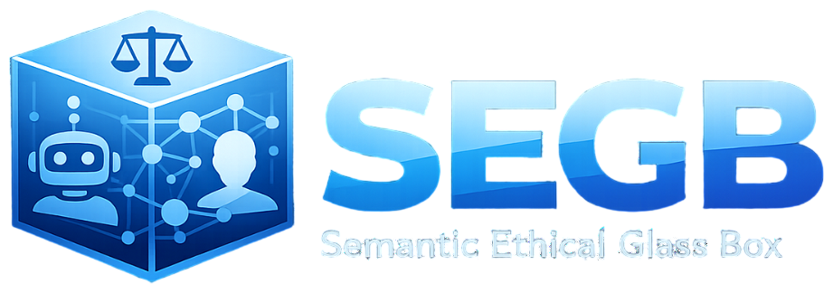

# Semantic Ethical Glass Box (SEGB)

<p align="center">
  
</p>

SEGB is a semantic logging stack for human-robot interaction. It captures interaction evidence as connected RDF
knowledge so you can inspect not only what happened, but also who was involved, which component or model acted, and
how the full trace fits together. This repository contains the full stack in one place: the reusable
`semantic_log_generator` package, the backend API, the web UI, the demo simulations, and the documentation.

In practice, a robot or simulator builds semantic logs, the backend receives them and manages the graph behind the
scenes, and the UI turns that data into reports, graph views, queries, and audit workflows.

## Quickstart

If you want the shortest meaningful run, this is the right path. It starts the centralized stack, loads the UC-02 demo
dataset, and opens the UI with real interaction data already prepared for reports and graph exploration.

### 1. Clone the repository and enter it

```bash
git clone https://github.com/gsi-upm/semantic_ethical_glass_box.git
cd semantic_ethical_glass_box
```

### 2. Create the local environment file

```bash
cp .env.example .env
```

For a first run, set only:

```env
VIRTUOSO_PASSWORD=change-this-password
```

Leave `SECRET_KEY` empty so authentication stays disabled during the demo.

### 3. Start the stack

```bash
docker compose -f docker-compose.yaml pull
docker compose -f docker-compose.yaml up -d
```

### 4. Create a small Python environment for the demo loader

```bash
python3 -m venv .segb_env
./.segb_env/bin/python -m pip install -U pip
./.segb_env/bin/python -m pip install -e packages/semantic_log_generator
./.segb_env/bin/python -m pip install pydantic
```

### 5. Load the UC-02 report-ready dataset

```bash
./.segb_env/bin/python -m examples.simulations.run_use_case_02_report_ready_dataset \
  --publish-url http://localhost:5000 \
  --no-print-ttl
```

This loader clears the configured graph before inserting the demo dataset.

### 6. Open the main entry points

- Reports: `http://localhost:8080/reports`
- Graph view: `http://localhost:8080/kg-graph`
- Backend API docs: `http://localhost:5000/docs`

If `/reports` shows populated cards and `/kg-graph` shows connected nodes, you have completed the full SEGB loop.

## Documentation

The full documentation is available on Read the Docs:
[semantic-ethical-black-box-segb.readthedocs.io/en/stable](https://semantic-ethical-black-box-segb.readthedocs.io/en/stable/)

Use these pages as the main reading path:

- First overview: [Home](docs/index.md)
- Package-first onboarding: [Package Overview](docs/package/index.md), [Install `semantic_log_generator`](docs/package/installation.md), [API Reference](docs/package/api-reference.md), [Use `semantic_log_generator`](docs/package/usage.md)
- First full run: [Quickstart](docs/getting-started/quickstart.md)
- Conceptual model: [Core Concepts and Roles](docs/getting-started/core-concepts-and-roles.md)
- First integration: [Publish Your First Log](docs/guides/publish-your-first-log.md)
- UI walkthrough: [Explore the Web UI](docs/guides/explore-the-web-ui.md)
- Shared context flow: [Shared Context Workflow](docs/guides/shared-context-workflow.md)
- ROS integration: [ROS4HRI Integration](docs/guides/ros4hri-integration.md)
- Deployment and operation: [Centralized Deployment](docs/operations/centralized-deployment.md), [Authentication and JWT](docs/operations/authentication-and-jwt.md)
- Protocol and data reference: [API and Roles](docs/reference/api-and-roles.md), [Ontology](docs/reference/ontology.md)

If you prefer to browse the docs from the repository, start at [docs/index.md](docs/index.md).
