# Explore The Web UI

This guide explains the SEGB UI page by page. Use it after [Quickstart](../getting-started/quickstart.md) or after you
publish your own data. The goal is to understand what each page is for and, in the case of the reports page, what each
report is trying to show.

## Before You Start

This guide works best with:

- the demo setup from [Quickstart](../getting-started/quickstart.md)
- authentication disabled for the first tour

If you later enable auth:

- read [Authentication and JWT](../operations/authentication-and-jwt.md) first
- use an `auditor` or `admin` token for `/reports`, `/kg-graph`, and `/query`
- use an `admin` token for `/shared-context`, `/logs/insert`, `/logs/delete`, and `/system/logs`

## Session

`http://localhost:8080/session` is the entry point for protected browsing. It stores the JWT in the browser session so
the rest of the UI can call protected endpoints. In the demo setup used by this guide, you do not need it.

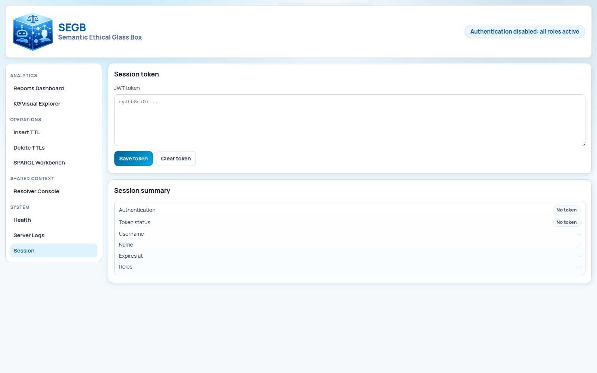

## Reports

`http://localhost:8080/reports` is the fastest way to decide whether your dataset is meaningful. A report in SEGB is a
fixed view derived from read-only graph queries. Open the page, click `Refresh reports`, and start here before you
inspect raw graph structure.

### Participants

This report shows which humans and robots appear together in the dataset. Use it first when you want to confirm that
identities and interaction links were captured cleanly.

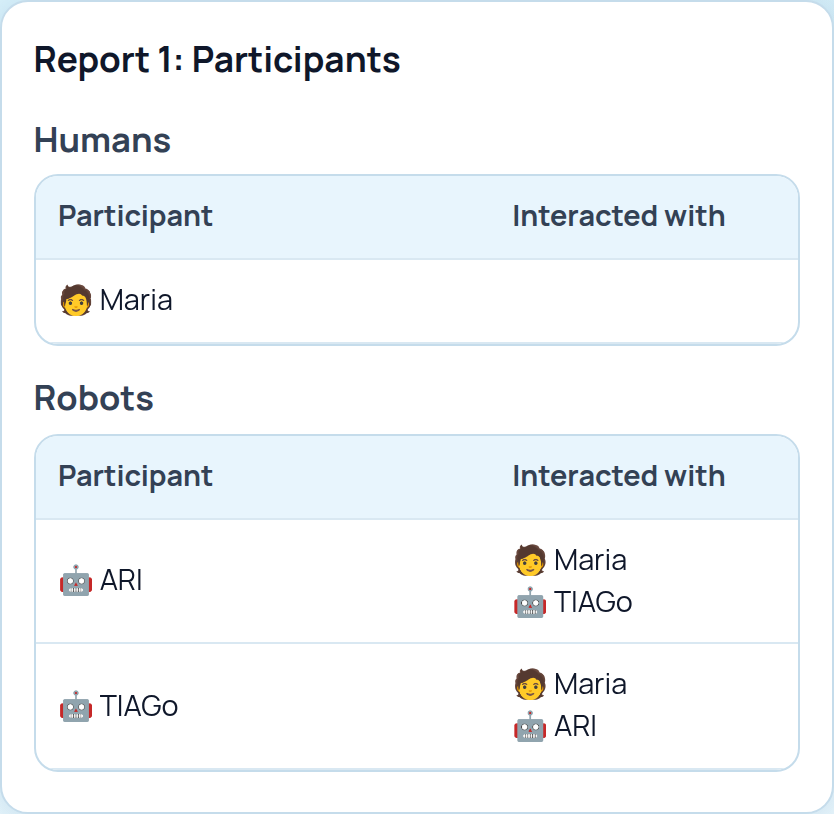

### ML Usage

This report shows which activities declare model usage and, when available, which model version, dataset, or evaluation
metadata traveled with that usage. It is the quickest sanity check for model provenance.

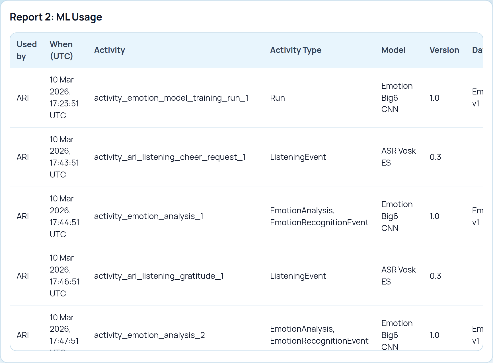

### Temporal Emotions

This report turns emotion analyses into temporal traces. It becomes meaningful when the graph contains timestamps,
targets, emotion categories, intensities, and optional confidence values.

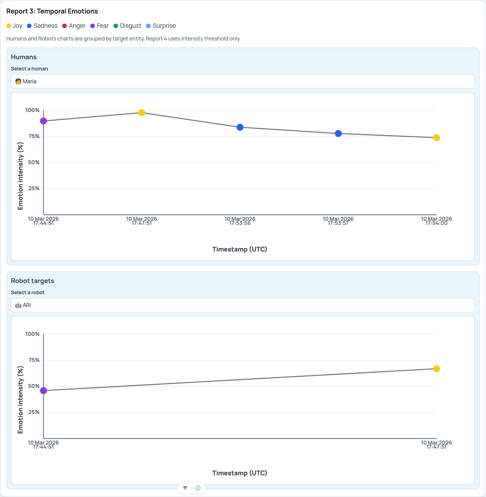

### Extreme Emotions

This view filters the emotion data down to high-intensity human-target samples. Use it when you want a quick review of
potentially significant emotional moments instead of the full timeline.

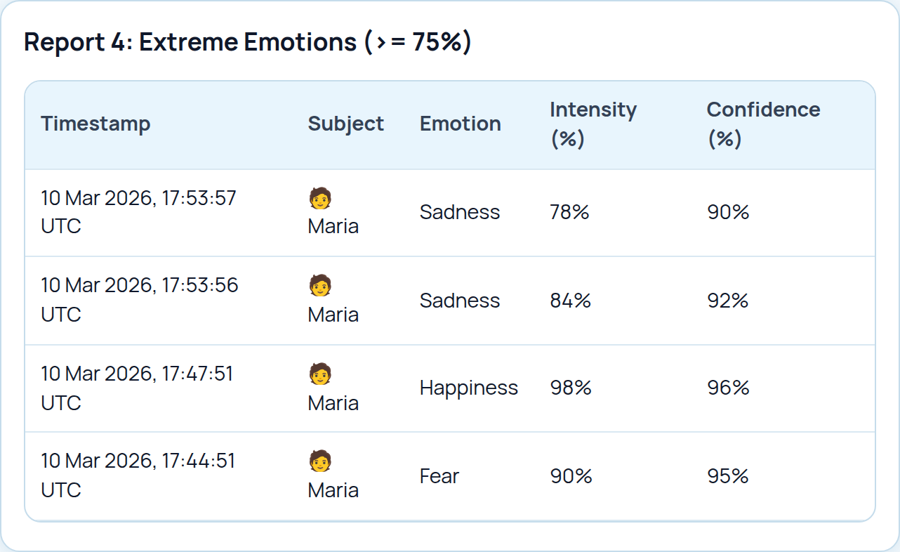

### Extreme Emotion Distribution

This chart aggregates the previous view by emotion category. It is useful when you want a fast summary of whether one
extreme emotion dominates the dataset.

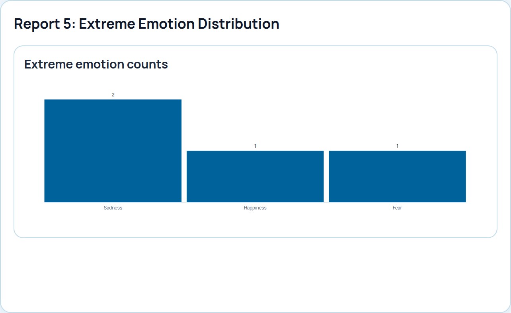

### Robot State Timeline

This report shows time-ordered robot state samples, usually with location information. It is useful when you need to
understand what the robot was doing or where it was over time.

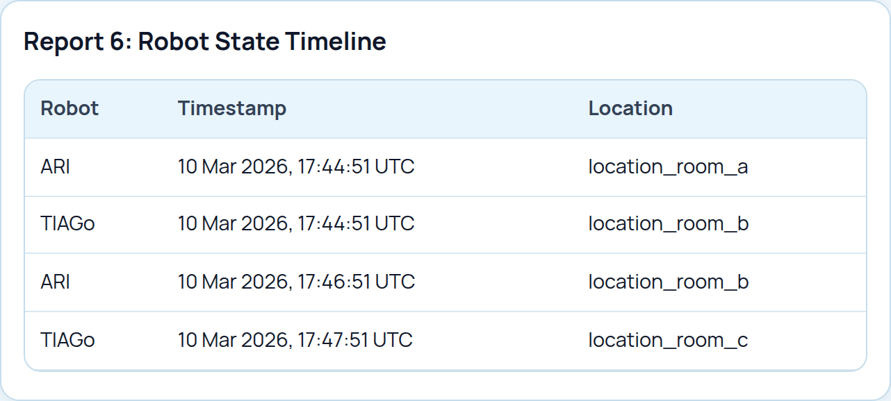

### Displacement Summary

This derived report condenses state changes into a per-robot movement summary, including the observed path and the
number of location changes.

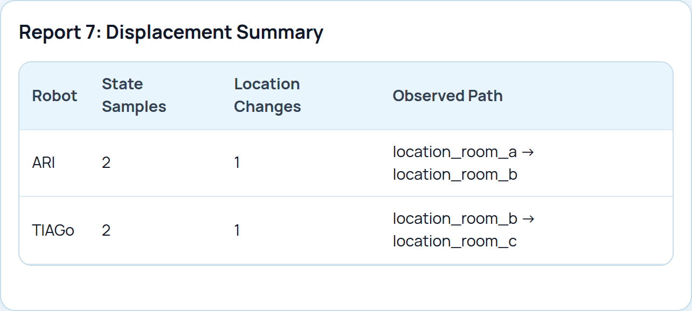

### Conversation History

This report groups messages into human-robot sessions and presents the message timeline. It is usually the most
human-readable reconstruction of an interaction.

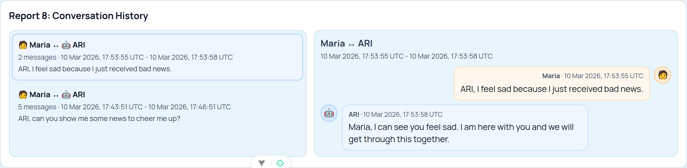

## Knowledge Graph Explorer

`http://localhost:8080/kg-graph` is the page to open when a report needs explanation. Use it to inspect which nodes
exist, how they connect, whether a message points back to an activity, and whether humans, robots, and shared events
belong to the same trace.

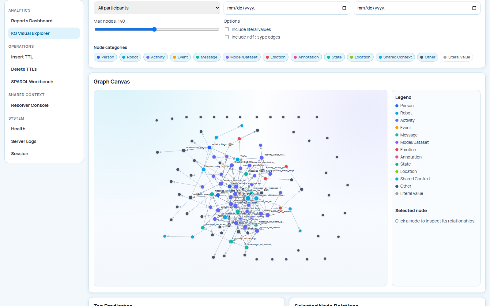

## Query Workbench

`http://localhost:8080/query` is for read-only SPARQL queries. Use it to confirm that a class or property is present,
count resources, or inspect a small slice of the graph before you change the pipeline. It is a debugging page, not a
reporting page.

## Shared-Context Review

`http://localhost:8080/shared-context` is the admin page for reviewing ambiguous shared-context cases. It becomes
meaningful when you run UC-03 or UC-04. The page shows counters, the pending queue, and the decision area. For the full
workflow behind it, continue with [Shared Context Workflow](shared-context-workflow.md). In protected mode this page
requires `admin`.

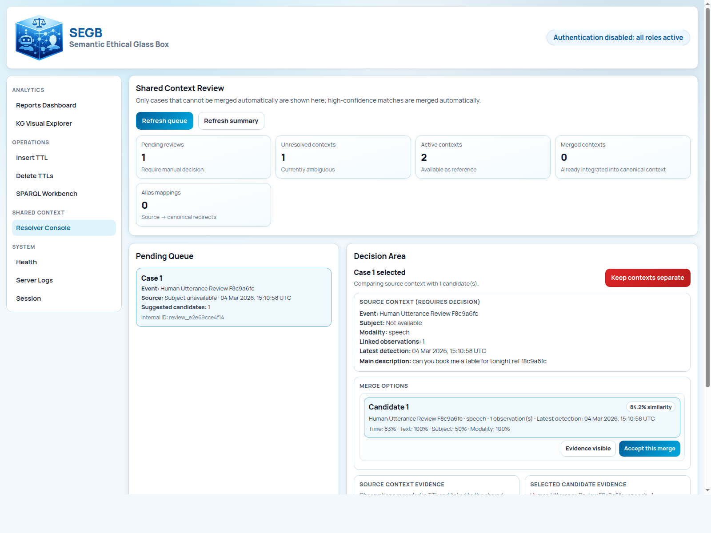

## Manual Insert And Delete

`http://localhost:8080/logs/insert` lets an admin validate and insert Turtle manually. `http://localhost:8080/logs/delete`
deletes the current graph content. These pages are useful for controlled demos and operational resets, not for normal
robot-side publishing. In protected mode both pages require `admin`.

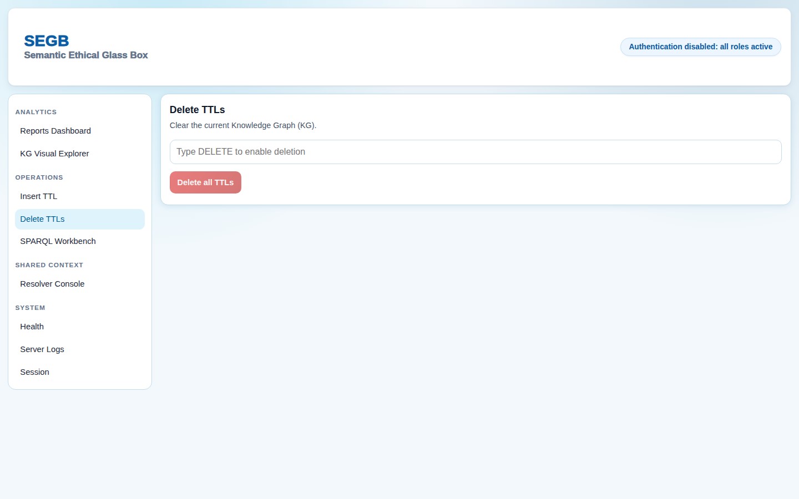

## System Logs And Health

`http://localhost:8080/health` gives browser-side live and ready checks. `http://localhost:8080/system/logs` exposes
backend-side evidence such as warnings, validation failures, and request errors. When the UI opens but data still looks
wrong, these pages usually tell you whether the issue is readiness, permissions, or the shape of the graph. In
protected mode `/system/logs` requires `admin`, while `/health` stays public.

### Health

Use `http://localhost:8080/health` when you want a quick answer to a basic question: is the backend alive, and is
Virtuoso reachable. It is the fastest UI check when the rest of the pages look empty or stale.

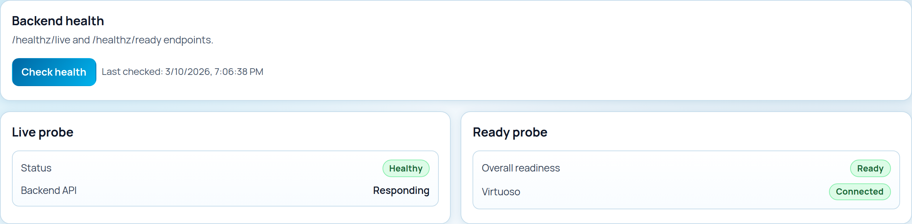

### Server Logs

Use `http://localhost:8080/system/logs` when health checks are not enough and you need backend-side evidence. This page
is useful for checking request errors, failed validations, and other operational messages.

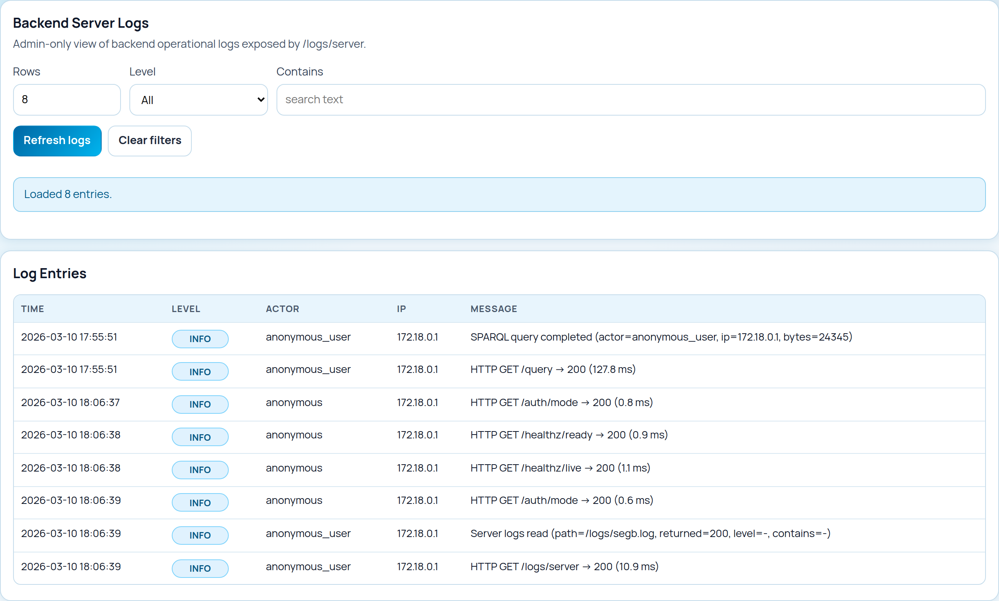

## Common Problems

- page redirects to `/session`: auth is enabled and your token is missing. This guide assumes auth is disabled, so the
  simplest fix is to return to the demo setup from Quickstart or configure a token first.
- reports are empty: the graph does not yet contain the semantics expected by the report queries. Reload the UC-02 demo dataset.
- health shows `ready=false`: the backend cannot reach Virtuoso.
- the UI loads but requests fail: your token may be expired even if the page layout itself opens.

## Next Steps

If you want to go deeper after this UI tour, continue with [Shared Context Workflow](shared-context-workflow.md),
[Authentication and JWT](../operations/authentication-and-jwt.md),
[Centralized Deployment](../operations/centralized-deployment.md), and
[API and Roles](../reference/api-and-roles.md).
