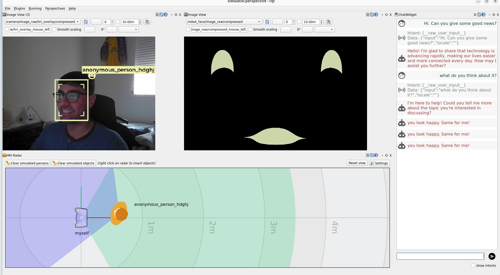
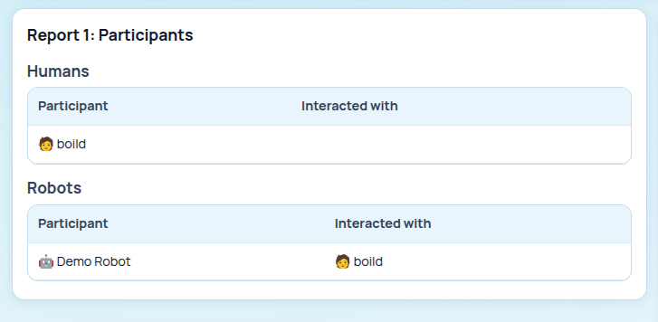
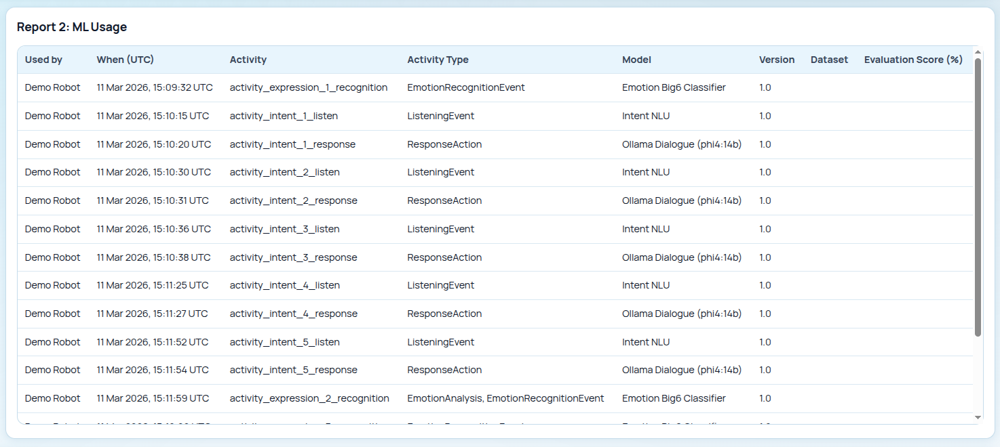
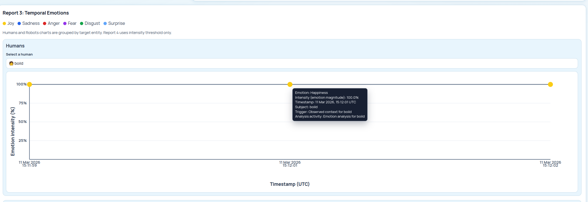
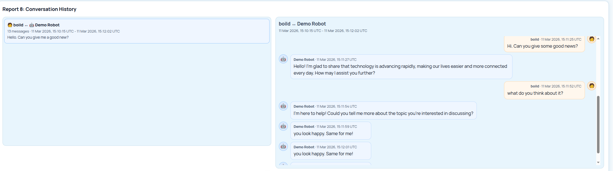

# ROS4HRI Integration

This guide describes how to integrate the SEGB toolkit into a social robot application in a Human-Robot Interaction scenario. The tutorial uses a PAL Robotics robot running in a ROS 2 simulator.

The starting point is an existing tutorial application, *Emotion Mirror*, in which the robot mirrors the emotion it detects from the user. We then extend this application with LLM capabilities to make the role of SEGB more evident in a richer interaction scenario.

Finally, we integrate the `semantic_log_generator` module so that the application can produce semantic logs, which can later be explored through the SEGB interface.

The process is presented incrementally. First, the original behaviour (from the ROS4HRI tutorial) is preserved so that the scenario remains easy to follow. Then, a lightweight Ollama-based reply generator is added to enrich the dialogue. Lastly, the relevant interaction points are instrumented with semantic logging and published to SEGB.

At the end of the tutorial, a single ROS node will be able to listen to the user, generate a short reply, mirror a facial expression, and publish a trace that can later be inspected in `/reports` and `/kg-graph` (i.e., the web UI).

## Before You Start

You need the ROS4HRI tutorial completed until Part 3 (including Parts 1 and 2):
<https://ros4hri.github.io/ros4hri-tutorials/interactive-social-robots/>

You also need:

- a working ROS 2 workspace with `emotion_mirror`
- a local checkout of this SEGB repository
- Docker Engine and Docker Compose v2
- Ollama installed locally if you want real LLM replies

For the first run, keep SEGB authentication disabled. That keeps the guide focused on the integration itself and avoids
JWT setup while you are still wiring the robot.

## Step 1: Start SEGB

Before touching the robot code, start the SEGB stack. This gives you a backend ready to receive Turtle payloads and a
UI ready to show the result. Starting SEGB first matters because it shortens the feedback loop: as soon as the robot
publishes something, you can verify it immediately.

From the SEGB repository root:

```bash
cp .env.example .env
docker compose -f docker-compose.yaml pull
docker compose -f docker-compose.yaml up -d
curl -s http://localhost:5000/healthz/ready
```

You want:

```json
{"ready": true, "virtuoso": true}
```

That response means the backend is up and its storage layer is reachable. If readiness stays `false`, stop here and
check [Centralized Deployment](../operations/centralized-deployment.md). There is no point instrumenting the robot if
the place where it should publish is not ready yet.

## Step 2: Install the Runtime Dependencies

Install the Python dependencies **inside the ros4hri Docker container**. In this guide, `semantic_log_generator` is used to build the TTL logs generated by the *Emotion Mirror* app, and `ollama` is used as the Python client to call the Ollama server from the application code.

```bash
pip install semantic-log-generator ollama
```

Verify that both Python packages are available inside the container:

```bash
python -c "from semantic_log_generator import SemanticSEGBLogger; print('semantic_log_generator ok')"
python -c "from ollama import Client; print('ollama python client ok')"
```

### Step 2.1: Install and Start Ollama on the Host (just if needed)

Ollama must run on the **local host machine**, not inside the ros4hri Docker container.

If Ollama is not installed on your host yet, install it with:

```bash
curl -fsSL https://ollama.com/install.sh | sh
```

Then start the Ollama runtime in a separate terminal on the host:

```bash
ollama serve
```

With the runtime running, pull the model used in this guide:

```bash
ollama pull phi4:14b
```

You can verify that Ollama is available with:

```bash
ollama list
```

If these checks pass, the environment is ready: the container can generate semantic logs through `semantic_log_generator`, and the application can optionally generate replies by connecting to the Ollama runtime running on the host.

## Step 3: Start From The Part 3 Mission Controller

This is the plain Part 3 `mission_controller.py` before Ollama and SEGB (that is, the result after finishing the Part 3 of the ROS4HRI tutorial). Use it as the baseline in your ROS
workspace:

```python
import json

from hri import HRIListener
from hri_actions_msgs.msg import Intent
from hri_msgs.msg import Expression
from rclpy.action import ActionClient
from rclpy.node import Node
from rclpy.qos import QoSProfile
from tts_msgs.action import TTS


class MissionController(Node):
    def __init__(self) -> None:
        super().__init__("emotion_mirror")

        self.create_subscription(Intent, "/intents", self.on_intent, 10)
        self.expression_pub = self.create_publisher(Expression, "/robot_face/expression", QoSProfile(depth=10))
        self.hri_listener = HRIListener("mimic_emotion_hrilistener")

        self.tts = ActionClient(self, TTS, "/say")
        self.tts.wait_for_server()

        self._last_expression = ""
        self.create_timer(0.1, self.run)

    def on_intent(self, msg: Intent) -> None:
        try:
            if msg.intent != Intent.RAW_USER_INPUT:
                return

            data = json.loads(msg.data) if msg.data else {}
            text = str(
                data.get("text")
                or data.get("utterance")
                or data.get("message")
                or data.get("object")
                or data.get("input")
                or msg.data
                or ""
            ).strip()
            if not text:
                return

            self._say("I heard you. Could you tell me a bit more so I can help you better?")
        except Exception as error:
            self.get_logger().error(f"on_intent exception (ignored): {type(error).__name__}: {error}")

    def run(self) -> None:
        try:
            faces = list(self.hri_listener.faces.items())
            if not faces:
                return

            _, face = faces[0]
            if not face.expression:
                return

            expression = face.expression.name.lower()
            if expression == self._last_expression:
                return
            self._last_expression = expression

            spoken = f"you look {expression}. Same for me!"
            self._say(spoken)

            out = Expression()
            out.expression = expression
            self.expression_pub.publish(out)
        except Exception as error:
            self.get_logger().error(f"run() exception (ignored): {type(error).__name__}: {error}")

    def _say(self, text: str) -> None:
        goal = TTS.Goal()
        goal.input = text
        self.tts.send_goal_async(goal)
```

This file already has the behavior you care about: it reacts to user input and mirrors observed expressions. That is
exactly why it is a good tutorial starting point. You are not inventing a new robot behavior for SEGB; you are taking a
behavior that already exists and making it explainable afterwards.

## Step 4: Add Ollama Before SEGB

Add Ollama first. That keeps the change easy to reason about. Before SEGB enters the picture, the robot still listens
and speaks exactly as before, but its spoken reply can now come from a local model instead of always being the same
fixed sentence.

!!! warning "Demo-only Ollama shortcut"
    This is not a good practice for integrating an LLM-based chatbot properly. Here we call Ollama directly from the
    mission controller only because it is the simplest option for demo purposes and keeps the SEGB tutorial small enough
    to follow in one pass.

    If you want to integrate a chatbot with an LLM in a more appropriate way, follow Chapter 3 of the original ROS4HRI
    tutorial: <https://ros4hri.github.io/ros4hri-tutorials/interactive-social-robots/?id=chapter-3-integration-with-llms>

Start with the import:

```python
try:
    from ollama import Client as OllamaClient
except Exception:
    OllamaClient = None
```

This keeps the file robust. If Ollama is not installed or not available in the current environment, the node still
starts and can fall back to a fixed reply.

Then add two class constants:

```python
class MissionController(Node):
    OLLAMA_HOST = "http://127.0.0.1:11434"
    OLLAMA_MODEL = "phi4:14b"
```

These constants keep the model configuration in one place instead of scattering it through the callback logic.

Initialize the client in `__init__`, right after `self.tts.wait_for_server()`:

```python
self.ollama = OllamaClient(host=self.OLLAMA_HOST) if OllamaClient else None
```

Now add a helper that asks Ollama for one short spoken reply and falls back cleanly if Ollama is missing or returns an
error:

```python
def _reply(self, text: str, user_name: str) -> tuple[str, str]:
    fallback = "I heard you. Could you tell me a bit more so I can help you better?"
    if not self.ollama:
        return fallback, "fallback"

    system = "You are a friendly social robot. Reply with one short, polite sentence suitable for speech output."
    user = f"User ({user_name}) says: {text}"

    try:
        response = self.ollama.chat(
            model=self.OLLAMA_MODEL,
            messages=[{"role": "system", "content": system}, {"role": "user", "content": user}],
        )
        content = ""
        if hasattr(response, "message") and getattr(response.message, "content", None):
            content = str(response.message.content)
        elif isinstance(response, dict):
            content = str(response.get("message", {}).get("content", ""))
        content = " ".join(content.split()).strip()
        return (content[:280] if content else fallback), ("ollama" if content else "fallback-empty")
    except Exception:
        return fallback, "fallback-ollama-error"
```

This helper deliberately returns two values: the reply itself and a small source label. That source label becomes useful
in the next step, because it lets the SEGB logs say whether the reply actually came from Ollama.

Finally, replace the fixed reply inside `on_intent`:

```python
human_hint = str(msg.source or "human_user")
name = str(data.get("name") or data.get("speaker") or data.get("user") or human_hint)
reply, _reply_source = self._reply(text, name)
self._say(reply)
```

At this point the robot still behaves like the same emotion mirror example, but its dialogue branch is already more
interesting. Only now is it worth adding SEGB around it.

## Step 5: Add SEGB Step By Step

Now add the SEGB part in the robot code. Keep using the same `mission_controller.py` in your robot workspace. The idea
is simple: add the semantic pieces in layers so each block has one clear purpose before you move to the next one.

### 5.1 Add The SEGB Imports At The Top Of The File

Insert these imports near the top of `mission_controller.py`:

```python
import threading
from datetime import datetime, timezone
from typing import Any

from semantic_log_generator import (
    ActivityKind,
    EmotionCategory,
    EmotionScore,
    RobotStateSnapshot,
    SEGBPublisher,
    SemanticSEGBLogger,
)
from semantic_log_generator.namespaces import EMOML, ORO
```

These imports bring in the SEGB pieces you use in the next steps: activity kinds, message and emotion vocabulary, state
snapshots, and the publisher that sends the graph to the backend.

### 5.2 Add The Tutorial SEGB Config Inside `MissionController`

Inside the `MissionController` class, use this exact block:

```python
class MissionController(Node):
    # Hardcoded tutorial config
    SEGB_BASE_NAMESPACE = "https://gsi.upm.es/segb/robots/demo_robot/v1/"
    SEGB_ROBOT_ID = "demo_robot"
    SEGB_ROBOT_NAME = "Demo Robot"
    SEGB_LANG = "en"
    SEGB_LOCATION = "location_demo_room"

    # If your SEGB backend is NOT running, set SEGB_ENABLE_PUBLISH = False
    SEGB_ENABLE_PUBLISH = True
    SEGB_API_URL = "http://localhost:5000"
    SEGB_API_TOKEN = ""
    SEGB_API_USER = "demo_robot"
    SEGB_TIMEOUT_SECONDS = 15.0

    OLLAMA_HOST = "http://127.0.0.1:11434"
    OLLAMA_MODEL = "phi4:14b"
```

Keep this block as simple local configuration. It names the robot in the graph, sets the backend URL, and defines the
publisher settings. `SEGB_API_TOKEN` should contain a `logger` JWT when backend auth is enabled, and it can stay empty
when auth is disabled. In this tutorial the code defaults to empty because the simplest path assumes local development
with auth disabled.

### 5.3 Initialize The Logger, Models, Publisher, And Local State In `__init__`

In `__init__`, insert this exact block after `self.ollama = ...`:

```python
self.segb = SemanticSEGBLogger(
    base_namespace=self.SEGB_BASE_NAMESPACE,
    robot_id=self.SEGB_ROBOT_ID,
    robot_name=self.SEGB_ROBOT_NAME,
    default_language=self.SEGB_LANG,
    namespace_prefix="emotion_mirror",
    compact_resource_ids=True,
)
self.intent_model = self.segb.register_ml_model("intent_nlu_v1", label="Intent NLU", version="1.0")
self.emotion_model = self.segb.register_ml_model(
    "emotion_big6_v1", label="Emotion Big6 Classifier", version="1.0"
)
self.chat_model = self.segb.register_ml_model(
    "ollama_dialogue_model",
    label=f"Ollama Dialogue ({self.OLLAMA_MODEL})",
    version="1.0",
)

self.publisher = None
if self.SEGB_ENABLE_PUBLISH:
    self.publisher = SEGBPublisher(
        base_url=self.SEGB_API_URL,
        token=self.SEGB_API_TOKEN,
        default_user=self.SEGB_API_USER,
        timeout_seconds=self.SEGB_TIMEOUT_SECONDS,
        verify_tls=True,
        queue_file="/tmp/emotion_mirror/segb_queue.jsonl",
    )

self._known_humans: dict[str, Any] = {}
self._last_expression = ""
self._intent_i = 0
self._expr_i = 0

self.create_timer(0.1, self.run)
```

This block initializes the semantic part of the node once at startup. It creates the logger, registers the models that
will appear in the trace, configures the publisher, and keeps a little local state for counters and stable human IDs.

### 5.4 Add The Helper Methods Near The End Of The Class

Add these methods near the end of the class:

```python
def _normalize_human_key(self, value: str | None) -> str:
    raw = str(value or "").strip()
    return "".join(c.lower() if c.isalnum() else "_" for c in raw).strip("_")

def _is_generic_human_key(self, value: str) -> bool:
    return value in {"", "human", "human_user", "person", "unknown", "unknown_human", "user"}

def _single_face_hint(self) -> str | None:
    try:
        face_ids = [str(face_id).strip() for face_id in self.hri_listener.faces.keys()]
    except Exception:
        return None

    face_ids = [face_id for face_id in face_ids if face_id]
    if len(face_ids) != 1:
        return None
    return face_ids[0]

def _human(self, hint: str, display_name: str, fallback_hint: str | None = None) -> Any:
    hint_key = self._normalize_human_key(hint)
    name_key = self._normalize_human_key(display_name)
    fallback_key = self._normalize_human_key(fallback_hint)

    if fallback_key and not self._is_generic_human_key(fallback_key):
        hid = fallback_key
    elif name_key and not self._is_generic_human_key(name_key):
        hid = name_key
    elif hint_key:
        hid = hint_key
    else:
        hid = "unknown_human"

    label = str(display_name).strip()
    if self._is_generic_human_key(name_key) and fallback_key and not self._is_generic_human_key(fallback_key):
        label = str(fallback_hint).strip()
    if not label:
        label = hid

    if hid not in self._known_humans:
        self._known_humans[hid] = self.segb.register_human(hid, first_name=label)
    return self._known_humans[hid]

def _state(self, *, event_id: str, activity: Any, note: str, extra: dict[str, Any] | None = None) -> None:
    snap = RobotStateSnapshot(
        timestamp=datetime.now(timezone.utc),
        autonomy_mode="interactive",
        mission_phase="demo",
        network_status="online",
        location=self.SEGB_LOCATION,
        note=note,
        custom=extra or {},
    )
    self.segb.log_robot_state(snap, state_id=event_id, source_activity=activity)

def _publish_segb_safe(self) -> None:
    if not self.publisher:
        return

    try:
        ttl = self.segb.serialize(format="turtle")
    except Exception as e:
        self.get_logger().warning(f"SEGB serialize failed (ignored): {type(e).__name__}: {e}")
        return

    def worker(payload: str) -> None:
        try:
            self.publisher.publish_turtle(payload, user=self.SEGB_API_USER)
        except Exception as e:
            self.get_logger().warning(f"SEGB publish failed (ignored): {type(e).__name__}: {e}")

    threading.Thread(target=worker, args=(ttl,), daemon=True).start()
```

These helpers keep the callbacks short and predictable. `_human` keeps the same person under one stable ID, `_state`
records a compact robot snapshot after each response, and `_publish_segb_safe` sends the graph without blocking the ROS
callback.

### 5.5 Instrument `on_intent`

Use this exact interaction block inside `on_intent`:

```python
self._intent_i += 1
event_id = f"intent_{self._intent_i}"
now = datetime.now(timezone.utc)

data = json.loads(msg.data) if msg.data else {}
text = str(
    data.get("text")
    or data.get("utterance")
    or data.get("message")
    or data.get("object")
    or data.get("input")
    or msg.data
    or ""
).strip()
if not text:
    return

human_hint = str(msg.source or "human_user")
name = str(data.get("name") or data.get("speaker") or data.get("user") or human_hint)
human_uri = self._human(human_hint, name, fallback_hint=self._single_face_hint())

shared = self.segb.get_shared_event_uri(
    event_kind="human_utterance",
    observed_at=now,
    subject=human_uri,
    text=text,
    modality=str(msg.modality or "speech"),
    event_id=f"{event_id}_shared",
)

listen_act = self.segb.log_activity(
    activity_id=f"{event_id}_listen",
    activity_kind=ActivityKind.LISTENING,
    label=f"Intent received: {msg.intent}",
    started_at=now,
    related_shared_events=[shared],
    used_models=[self.intent_model],
)
in_msg = self.segb.log_message(
    text,
    message_id=f"{event_id}_input",
    language=self.SEGB_LANG,
    message_types=[ORO.InitialMessage],
    generated_by_activity=listen_act,
    sender=human_uri,
)

reply, reply_source = self._reply(text, name)
self._say(reply)

resp_act = self.segb.log_activity(
    activity_id=f"{event_id}_response",
    activity_kind=ActivityKind.RESPONSE,
    label=f"Robot answers ({reply_source})",
    started_at=datetime.now(timezone.utc),
    triggered_by_activity=listen_act,
    triggered_by_entity=in_msg,
    used_entities=[in_msg],
    used_models=[self.chat_model] if reply_source == "ollama" else None,
    related_shared_events=[shared],
)
self.segb.log_message(
    reply,
    message_id=f"{event_id}_output",
    language=self.SEGB_LANG,
    message_types=[ORO.ResponseMessage],
    generated_by_activity=resp_act,
    previous_message=in_msg,
    sender=self.segb.robot_uri,
)

self._state(
    event_id=f"{event_id}_state",
    activity=resp_act,
    note="Intent processed",
    extra={"reply_source": reply_source},
)

self._publish_segb_safe()
```

This block turns one user utterance into a traceable interaction: extract the text, resolve the shared event, log the
listening activity and human message, generate the reply, log the robot response, snapshot the state, and publish the
updated graph. The most important lines for later conversation reconstruction are `message_types=[ORO.InitialMessage]`,
`message_types=[ORO.ResponseMessage]`, `sender=human_uri`, and `sender=self.segb.robot_uri`.

### 5.6 Instrument `run`

This branch does the same kind of work for a detected facial expression: identify the event, link it to shared context,
record what the robot perceived, log the robot reaction, snapshot the state, and publish.

```python
face_id, face = faces[0]
if not face.expression:
    return

expression = face.expression.name.lower()
if expression == self._last_expression:
    return
self._last_expression = expression

self._expr_i += 1
event_id = f"expression_{self._expr_i}"
now = datetime.now(timezone.utc)

human_uri = self._human(str(face_id), str(face_id))
shared = self.segb.get_shared_event_uri(
    event_kind="human_expression",
    observed_at=now,
    subject=human_uri,
    text=expression,
    modality="vision",
    event_id=f"{event_id}_shared",
)

recog = self.segb.log_activity(
    activity_id=f"{event_id}_recognition",
    activity_kind=ActivityKind.EMOTION_RECOGNITION,
    label=f"Detected expression '{expression}' for face {face_id}",
    started_at=now,
    related_shared_events=[shared],
    used_models=[self.emotion_model],
)

obs = self.segb.log_observation(
    observation_id=f"{event_id}_face",
    label=f"Face {face_id} expression {expression}",
    generated_by_activity=recog,
    related_shared_event=shared,
    confidence=1.0,
)

self.segb.log_emotion_annotation(
    source_activity=recog,
    annotation_id=f"{event_id}_annotation",
    targets=[human_uri],
    emotions=[EmotionScore(category=EmotionCategory.from_expression(expression), intensity=1.0)],
    emotion_model=EMOML.big6,
)

spoken = f"you look {expression}. Same for me!"
self._say(spoken)

out = Expression()
out.expression = expression
self.expression_pub.publish(out)

resp = self.segb.log_activity(
    activity_id=f"{event_id}_response",
    activity_kind=ActivityKind.RESPONSE,
    label=f"Robot mirrors '{expression}'",
    started_at=datetime.now(timezone.utc),
    triggered_by_activity=recog,
    triggered_by_entity=obs,
    used_entities=[obs],
    related_shared_events=[shared],
)
self.segb.log_message(
    spoken,
    message_id=f"{event_id}_output",
    language=self.SEGB_LANG,
    message_types=[ORO.ResponseMessage],
    generated_by_activity=resp,
    sender=self.segb.robot_uri,
)
self._state(
    event_id=f"{event_id}_state",
    activity=resp,
    note=f"Mirroring '{expression}'",
    extra={"expression": expression, "face_id": str(face_id)},
)

self._publish_segb_safe()
```

This follows the same pattern as the dialogue branch, but for an observed facial expression: detect, link to shared
context, record the observation and annotation, log the robot reaction, snapshot the state, and publish.

## Step 6: Final Integrated Version

If you want to compare your file against a complete result after all the previous edits, use the version below. It is a
literal copy of the current source file:

```python
import json
import threading
from datetime import datetime, timezone
from typing import Any

from hri import HRIListener
from hri_actions_msgs.msg import Intent
from hri_msgs.msg import Expression
from rclpy.action import ActionClient
from rclpy.node import Node
from rclpy.qos import QoSProfile
from semantic_log_generator import (
    ActivityKind,
    EmotionCategory,
    EmotionScore,
    RobotStateSnapshot,
    SEGBPublisher,
    SemanticSEGBLogger,
)
from semantic_log_generator.namespaces import EMOML, ORO
from tts_msgs.action import TTS

try:
    from ollama import Client as OllamaClient
except Exception:
    OllamaClient = None


class MissionController(Node):
    # Hardcoded tutorial config
    SEGB_BASE_NAMESPACE = "https://gsi.upm.es/segb/robots/demo_robot/v1/"
    SEGB_ROBOT_ID = "demo_robot"
    SEGB_ROBOT_NAME = "Demo Robot"
    SEGB_LANG = "en"
    SEGB_LOCATION = "location_demo_room"

    # If your SEGB backend is NOT running, set SEGB_ENABLE_PUBLISH = False
    SEGB_ENABLE_PUBLISH = True
    SEGB_API_URL = "http://localhost:5000"
    SEGB_API_TOKEN = ""
    SEGB_API_USER = "demo_robot"
    SEGB_TIMEOUT_SECONDS = 15.0

    OLLAMA_HOST = "http://127.0.0.1:11434"
    OLLAMA_MODEL = "phi4:14b"

    def __init__(self) -> None:
        super().__init__("emotion_mirror")

        # ROS I/O
        self.create_subscription(Intent, "/intents", self.on_intent, 10)
        self.expression_pub = self.create_publisher(Expression, "/robot_face/expression", QoSProfile(depth=10))
        self.hri_listener = HRIListener("mimic_emotion_hrilistener")

        # TTS
        self.tts = ActionClient(self, TTS, "/say")
        self.tts.wait_for_server()

        # Ollama (single line, no probing)
        self.ollama = OllamaClient(host=self.OLLAMA_HOST) if OllamaClient else None

        # SEGB logger
        self.segb = SemanticSEGBLogger(
            base_namespace=self.SEGB_BASE_NAMESPACE,
            robot_id=self.SEGB_ROBOT_ID,
            robot_name=self.SEGB_ROBOT_NAME,
            default_language=self.SEGB_LANG,
            namespace_prefix="emotion_mirror",
            compact_resource_ids=True,
        )
        self.intent_model = self.segb.register_ml_model("intent_nlu_v1", label="Intent NLU", version="1.0")
        self.emotion_model = self.segb.register_ml_model(
            "emotion_big6_v1", label="Emotion Big6 Classifier", version="1.0"
        )
        self.chat_model = self.segb.register_ml_model(
            "ollama_dialogue_model",
            label=f"Ollama Dialogue ({self.OLLAMA_MODEL})",
            version="1.0",
        )

        self.publisher = None
        if self.SEGB_ENABLE_PUBLISH:
            self.publisher = SEGBPublisher(
                base_url=self.SEGB_API_URL,
                token=self.SEGB_API_TOKEN,
                default_user=self.SEGB_API_USER,
                timeout_seconds=self.SEGB_TIMEOUT_SECONDS,
                verify_tls=True,
                queue_file="/tmp/emotion_mirror/segb_queue.jsonl",
            )

        # Simple state
        self._known_humans: dict[str, Any] = {}
        self._last_expression = ""
        self._intent_i = 0
        self._expr_i = 0

        # Poll faces at 10 Hz
        self.create_timer(0.1, self.run)

    # ------------------------
    # Callbacks
    # ------------------------
    def on_intent(self, msg: Intent) -> None:
        # "never crash tutorial mode"
        try:
            if msg.intent != Intent.RAW_USER_INPUT:
                return

            self._intent_i += 1
            event_id = f"intent_{self._intent_i}"
            now = datetime.now(timezone.utc)

            data = json.loads(msg.data) if msg.data else {}
            text = str(
                data.get("text")
                or data.get("utterance")
                or data.get("message")
                or data.get("object")
                or data.get("input")
                or msg.data
                or ""
            ).strip()
            if not text:
                return

            human_hint = str(msg.source or "human_user")
            name = str(data.get("name") or data.get("speaker") or data.get("user") or human_hint)
            human_uri = self._human(human_hint, name, fallback_hint=self._single_face_hint())

            shared = self.segb.get_shared_event_uri(
                event_kind="human_utterance",
                observed_at=now,
                subject=human_uri,
                text=text,
                modality=str(msg.modality or "speech"),
                event_id=f"{event_id}_shared",
            )

            listen_act = self.segb.log_activity(
                activity_id=f"{event_id}_listen",
                activity_kind=ActivityKind.LISTENING,
                label=f"Intent received: {msg.intent}",
                started_at=now,
                related_shared_events=[shared],
                used_models=[self.intent_model],
            )
            in_msg = self.segb.log_message(
                text,
                message_id=f"{event_id}_input",
                language=self.SEGB_LANG,
                message_types=[ORO.InitialMessage],
                generated_by_activity=listen_act,
                sender=human_uri,
            )

            reply, reply_source = self._reply(text, name)
            self._say(reply)

            resp_act = self.segb.log_activity(
                activity_id=f"{event_id}_response",
                activity_kind=ActivityKind.RESPONSE,
                label=f"Robot answers ({reply_source})",
                started_at=datetime.now(timezone.utc),
                triggered_by_activity=listen_act,
                triggered_by_entity=in_msg,
                used_entities=[in_msg],
                used_models=[self.chat_model] if reply_source == "ollama" else None,
                related_shared_events=[shared],
            )
            self.segb.log_message(
                reply,
                message_id=f"{event_id}_output",
                language=self.SEGB_LANG,
                message_types=[ORO.ResponseMessage],
                generated_by_activity=resp_act,
                previous_message=in_msg,
                sender=self.segb.robot_uri,
            )

            self._state(
                event_id=f"{event_id}_state",
                activity=resp_act,
                note="Intent processed",
                extra={"reply_source": reply_source},
            )

            self._publish_segb_safe()

        except Exception as e:
            self.get_logger().error(f"on_intent exception (ignored): {type(e).__name__}: {e}")

    def run(self) -> None:
        # "never crash tutorial mode"
        try:
            faces = list(self.hri_listener.faces.items())
            if not faces:
                return

            face_id, face = faces[0]
            if not face.expression:
                return

            expression = face.expression.name.lower()
            if expression == self._last_expression:
                return
            self._last_expression = expression

            self._expr_i += 1
            event_id = f"expression_{self._expr_i}"
            now = datetime.now(timezone.utc)

            human_uri = self._human(str(face_id), str(face_id))
            shared = self.segb.get_shared_event_uri(
                event_kind="human_expression",
                observed_at=now,
                subject=human_uri,
                text=expression,
                modality="vision",
                event_id=f"{event_id}_shared",
            )

            recog = self.segb.log_activity(
                activity_id=f"{event_id}_recognition",
                activity_kind=ActivityKind.EMOTION_RECOGNITION,
                label=f"Detected expression '{expression}' for face {face_id}",
                started_at=now,
                related_shared_events=[shared],
                used_models=[self.emotion_model],
            )

            obs = self.segb.log_observation(
                observation_id=f"{event_id}_face",
                label=f"Face {face_id} expression {expression}",
                generated_by_activity=recog,
                related_shared_event=shared,
                confidence=1.0,
            )

            # This can throw for "neutral" etc. It's inside try/except so it won't kill the node.
            self.segb.log_emotion_annotation(
                source_activity=recog,
                annotation_id=f"{event_id}_annotation",
                targets=[human_uri],
                emotions=[EmotionScore(category=EmotionCategory.from_expression(expression), intensity=1.0)],
                emotion_model=EMOML.big6,
            )

            spoken = f"you look {expression}. Same for me!"
            self._say(spoken)

            out = Expression()
            out.expression = expression
            self.expression_pub.publish(out)

            resp = self.segb.log_activity(
                activity_id=f"{event_id}_response",
                activity_kind=ActivityKind.RESPONSE,
                label=f"Robot mirrors '{expression}'",
                started_at=datetime.now(timezone.utc),
                triggered_by_activity=recog,
                triggered_by_entity=obs,
                used_entities=[obs],
                related_shared_events=[shared],
            )
            self.segb.log_message(
                spoken,
                message_id=f"{event_id}_output",
                language=self.SEGB_LANG,
                message_types=[ORO.ResponseMessage],
                generated_by_activity=resp,
                sender=self.segb.robot_uri,
            )
            self._state(
                event_id=f"{event_id}_state",
                activity=resp,
                note=f"Mirroring '{expression}'",
                extra={"expression": expression, "face_id": str(face_id)},
            )

            self._publish_segb_safe()

        except Exception as e:
            self.get_logger().error(f"run() exception (ignored): {type(e).__name__}: {e}")

    # ------------------------
    # Helpers
    # ------------------------
    def _say(self, text: str) -> None:
        goal = TTS.Goal()
        goal.input = text
        self.tts.send_goal_async(goal)

    def _normalize_human_key(self, value: str | None) -> str:
        raw = str(value or "").strip()
        return "".join(c.lower() if c.isalnum() else "_" for c in raw).strip("_")

    def _is_generic_human_key(self, value: str) -> bool:
        return value in {"", "human", "human_user", "person", "unknown", "unknown_human", "user"}

    def _single_face_hint(self) -> str | None:
        try:
            face_ids = [str(face_id).strip() for face_id in self.hri_listener.faces.keys()]
        except Exception:
            return None

        face_ids = [face_id for face_id in face_ids if face_id]
        if len(face_ids) != 1:
            return None
        return face_ids[0]

    def _human(self, hint: str, display_name: str, fallback_hint: str | None = None) -> Any:
        hint_key = self._normalize_human_key(hint)
        name_key = self._normalize_human_key(display_name)
        fallback_key = self._normalize_human_key(fallback_hint)

        if fallback_key and not self._is_generic_human_key(fallback_key):
            hid = fallback_key
        elif name_key and not self._is_generic_human_key(name_key):
            hid = name_key
        elif hint_key:
            hid = hint_key
        else:
            hid = "unknown_human"

        label = str(display_name).strip()
        if self._is_generic_human_key(name_key) and fallback_key and not self._is_generic_human_key(fallback_key):
            label = str(fallback_hint).strip()
        if not label:
            label = hid

        if hid not in self._known_humans:
            self._known_humans[hid] = self.segb.register_human(hid, first_name=label)
        return self._known_humans[hid]

    def _reply(self, text: str, user_name: str) -> tuple[str, str]:
        fallback = "I heard you. Could you tell me a bit more so I can help you better?"
        if not self.ollama:
            return fallback, "fallback"

        system = "You are a friendly social robot. Reply with one short, polite sentence suitable for speech output."
        user = f"User ({user_name}) says: {text}"

        try:
            r = self.ollama.chat(
                model=self.OLLAMA_MODEL,
                messages=[{"role": "system", "content": system}, {"role": "user", "content": user}],
            )
            content = ""
            if hasattr(r, "message") and getattr(r.message, "content", None):
                content = str(r.message.content)
            elif isinstance(r, dict):
                content = str(r.get("message", {}).get("content", ""))
            content = " ".join(content.split()).strip()
            return (content[:280] if content else fallback), ("ollama" if content else "fallback-empty")
        except Exception:
            return fallback, "fallback-ollama-error"

    def _state(self, *, event_id: str, activity: Any, note: str, extra: dict[str, Any] | None = None) -> None:
        snap = RobotStateSnapshot(
            timestamp=datetime.now(timezone.utc),
            autonomy_mode="interactive",
            mission_phase="demo",
            network_status="online",
            location=self.SEGB_LOCATION,
            note=note,
            custom=extra or {},
        )
        self.segb.log_robot_state(snap, state_id=event_id, source_activity=activity)

    def _publish_segb_safe(self) -> None:
        # If disabled or no publisher, do nothing
        if not self.publisher:
            return

        # Serialize safely
        try:
            ttl = self.segb.serialize(format="turtle")
        except Exception as e:
            self.get_logger().warning(f"SEGB serialize failed (ignored): {type(e).__name__}: {e}")
            return

        # Publish in background to avoid blocking callbacks
        def worker(payload: str) -> None:
            try:
                self.publisher.publish_turtle(payload, user=self.SEGB_API_USER)
            except Exception as e:
                self.get_logger().warning(f"SEGB publish failed (ignored): {type(e).__name__}: {e}")

        threading.Thread(target=worker, args=(ttl,), daemon=True).start()

```

That full file is only a final check. The tutorial path is still the right way to follow it: add Ollama first, then the
SEGB imports and constants, then the logger and publisher, then the helper methods, then the dialogue instrumentation,
and finally the facial-expression instrumentation.

## Step 7: Run the Robot

Inside the ros4hri Docker container, run the simulator if you have not done so already:

```bash
ros2 launch interaction_sim simulator.launch.py
```

Open a new terminal in the container with:

```bash
docker exec -it -u user ros4hri bash
```

and run:

```bash
colcon build
source install/setup.bash
ros2 launch emotion_mirror emotion_mirror.launch.py
```

Interact with the simulator. Speak to the robot so that `on_intent` runs. You can use the chat widget on the right side of the screen to simulate a spoken interaction; if Ollama is available, the dialogue reply will come from the local model (`phi4:14b`). If not, the robot will answer with a fixed reply. You can also show expressions to your webcam so that the social robot can mirror your emotion. When the robot, according to *Emotion Mirror*, detects a new emotion on your face, it says "**you look <target_emotion\>, same for me!**" via the chat widget.

You should see something like this (pay close attention to how the robot's face mirrors the human's emotion):



## Step 8: Auditing the Scenario

At this point, we have:

1. Configured a ROS2-based social robot to generate SEGB-like TTL-formatted logs.
2. Deployed the centralized SEGB stack.
3. Executed a simulated HRI scenario in which a human interacts with a social robot.

The last step, which is in fact the main objective of the SEGB framework, is to audit the scenario in terms of traceability and explainability. To do this, we will use the web UI to inspect the high-level reports describing the scenario. Let's open `http://localhost:8080/reports`.

#### Report 1: Participants

It shows the participants logged within the scenario. We can observe the Demo Robot and the human user (identified by a randomly generated string).



#### Report 2: ML Usage

It describes the different AI models that the Demo Robot used to carry out the different tasks. The use of `phi4:14b` for the response actions and the `Emotion Big6 Classifier` for emotion detection is particularly noteworthy.



#### Report 3: Temporal Emotions

It describes the emotional timeline of both the human and the robot. In the image below, we focus on the human's timeline. As we can see, the human is feeling happiness over time, as we previously saw in the simulator screenshot.



#### Report 4: Conversation History

This report compiles the messages associated with a conversation between a human and a robot, showing extra data such as the time of each message and who said it. In this case, since we simulated the conversation via chat, we can simply observe that the messages are identical to the ones previously shown in the simulator screenshot.



## What This Integration Gives You

Without SEGB, the emotion mirror example runs, speaks, and reacts, but it leaves very little behind for later review. With SEGB, the same interaction becomes easily auditable and traceable. You can trace what the robot heard, what it answered, what expression it detected, and which action followed. In scenarios involving several robots and humans interacting with one another, SEGB becomes even more valuable, as it provides isolated logs with contextual information by linking related events (e.g., an event that triggered another one) and creating a shared context that anchors the same events logged simultaneously by different robots.

That is the practical value of this guide: not changing the robot's behavior for its own sake, but making that behavior explainable after it has happened.

## Next Steps

Once this simpler integration works, we recommend implementing the following improvements:

1. Calibrate the face branch with confidence scores or richer emotion mappings if you need more than the basic expression-to-emotion annotation.
2. Launch several simulator instances to create a scenario with more than one robot, adding shared-context resolution.