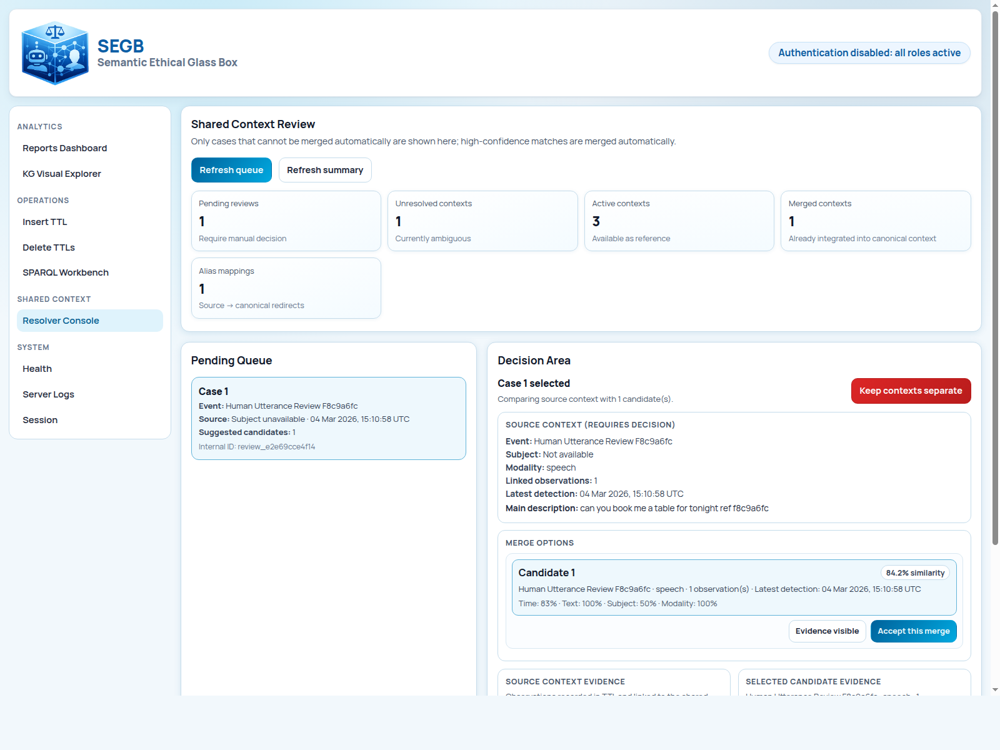

# Shared Context Workflow

## What You Will Learn

This guide shows how SEGB handles one of its most useful ideas: recognizing that two different observations may describe
the same real-world event.

You will see:

1. an automatic match,
2. an ambiguous case,
3. a manual review in the UI,
4. the backend endpoints behind that flow.

## Why Shared Context Exists

Imagine two robots in the same room:

- robot A hears a sentence,
- robot B hears almost the same sentence a moment later.

If you store those as unrelated events, later analysis becomes confusing. Shared context gives both observations a common
reference when the system believes they point to the same event.

This is especially helpful for:

- multi-robot speech observations,
- multi-camera facial expression observations,
- shared gestures or actions observed by different components.

## Before You Start

You need:

- backend and UI running
- the local simulation environment available at `./.segb_env`
- to run commands from the repository root

If auth is enabled, open `/session` first and set an `admin` token. The shared-context review page requires admin access.

## Step 1: Open The Shared-Context Page

Open:

- `http://localhost:8080/shared-context`

This is the main UI for the workflow. It shows:

- summary counters,
- the pending review queue,
- the decision area for accept or reject actions.

## Step 2: Run The Automatic Match Example

This example uses UC-03. It sends two very similar observations close in time.

If auth is disabled:

```bash
./.segb_env/bin/python -m examples.simulations.run_use_case_03_shared_context_auto_match \
  --publish-url http://localhost:5000 \
  --no-print-ttl
```

If auth is enabled:

```bash
./.segb_env/bin/python -m examples.simulations.run_use_case_03_shared_context_auto_match \
  --publish-url http://localhost:5000 \
  --token "<admin_jwt>" \
  --no-print-ttl
```

What this script is trying to prove is simple:

- the first observation usually creates a shared context,
- the second one should match that same shared context.

What to look for:

- the script output should report `second_status = matched`,
- the UI should still show `Pending reviews = 0`,
- the active contexts count should increase.

## Step 3: Run The Ambiguous Example

Now run UC-04 with no decision so you can review the case manually in the UI:

If auth is disabled:

```bash
./.segb_env/bin/python -m examples.simulations.run_use_case_04_shared_context_ambiguous_review \
  --publish-url http://localhost:5000 \
  --decision none \
  --no-print-ttl
```

If auth is enabled:

```bash
./.segb_env/bin/python -m examples.simulations.run_use_case_04_shared_context_ambiguous_review \
  --publish-url http://localhost:5000 \
  --token "<admin_jwt>" \
  --decision none \
  --no-print-ttl
```

This case creates uncertainty on purpose. The observations are similar enough to suggest a connection, but not clean
enough for the resolver to merge them automatically.

What to expect in the UI:

- `Pending reviews` should increase,
- a case should appear in the queue,
- candidate targets should be available in the decision area.

Reference screenshot:


## Step 4: Review The Case Manually

In the decision area you can choose between two actions:

- accept the merge,
- keep the contexts separate.

After you make a decision, refresh the summary and queue.

Typical results:

- the pending count decreases,
- accepted merges increase the merged or alias-related counters,
- the case disappears from the queue.

Reference screenshot:



## Step 5: Check The Backend Endpoints Behind The UI

The UI is the easiest place to work, but it helps to know the backend pieces underneath:

- `POST /shared-context/resolve`
- `POST /shared-context/reconcile`
- `GET /shared-context/stats`
- `GET /shared-context/review/pending`
- `POST /shared-context/review/{case_id}/accept`
- `POST /shared-context/review/{case_id}/reject`

Useful raw checks:

```bash
curl -s http://localhost:5000/shared-context/stats
curl -s http://localhost:5000/shared-context/review/pending
```

If auth is enabled, add the bearer token:

```bash
curl -s http://localhost:5000/shared-context/stats \
  -H "Authorization: Bearer <admin_or_auditor_jwt>"

curl -s http://localhost:5000/shared-context/review/pending \
  -H "Authorization: Bearer <admin_jwt>"
```

## What Success Looks Like

You have completed the workflow correctly if:

- UC-03 reports a matched second observation,
- UC-04 creates a pending ambiguous case,
- the UI lets you review that case,
- the counters update after your decision.

## Common Problems

- everything is always `created`: the observations are too different in time, subject, modality, or text to be matched.
- `/shared-context` returns `403`: your token is missing the `admin` role.
- the queue does not refresh after a decision: refresh the page and then inspect backend logs if needed.

## Next Steps

If you want to see where these use cases fit in the bigger picture, read [Use-Case Matrix](../reference/use-case-matrix.md).
