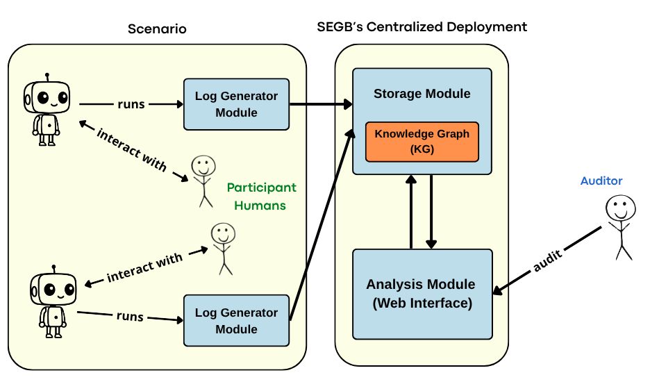

# Semantic Ethical Glass Box (SEGB)

  

SEGB is a semantic logging stack for human-robot interaction. It captures interaction evidence as connected RDF
knowledge so you can inspect not only what happened, but also who did it, which model was involved, what followed, and
how the pieces belong to the same trace.

The practical contract is straightforward. Consider a scenario in which multiple humans and social robots interact with each other. The robots emit Turtle (TTL) logs describing internal processes, actors, activities, messages, and the links between them. The backend ingests and processes these logs and stores them in a global Knowledge Graph (KG). This KG provides a semantic representation of the scenario, relating actors and activities and capturing the context in which one event triggers another. A web UI then provides high-level reports and tools to visualise and filter the KG, making scenario auditing and explanation easier.

## Why Teams Use SEGB

SEGB is for systems that need more than plain application logs. It is useful when you want to reconstruct what
happened in an interaction involving several humans, robots, or components. Instead of leaving each log line isolated,
SEGB gives every observation a place in a shared Knowledge Graph where events are connected and can be searched
structurally. That makes it easier to explain a robot decision in context, compare observations from different
components, and preserve evidence that can later be reviewed by an auditor.

## Why "Ethical"

The "ethical" part is about traceability and explainability. SEGB preserves the evidence needed to review how a
robot interaction unfolded: which inputs were observed, which model or component produced an interpretation, which
action followed, and what context connected those steps. That makes transparency and post-hoc audit practical instead
of aspirational, and it helps you detect problematic behavior, understand where it came from, and correct it.

## What You Adopt

| Goal | Adopt |
|---|---|
| generate semantic logs inside your runtime | `semantic_log_generator` |
| store and query logs centrally | `semantic_log_generator` and the backend API |
| inspect interactions visually | the full stack, including the web UI |

SEGB is not a robot framework, a sensor driver, or a ROS replacement. Your robot software still decides what to
detect, what to say, and when to act. `semantic_log_generator` does not make those decisions for you; it turns the
facts your software already knows into TTL that can be ingested, queried, and reviewed later.

## Architecture In One Pass

SEGB separates log production, ingestion, storage, and inspection.

At the edge, `semantic_log_generator` materializes interaction facts as RDF resources and links: robots, humans,
activities, messages, model usage, observations, and result entities. Those triples are serialized as Turtle and sent
to the backend, which validates and stores them in the Knowledge
Graph. In this repository, the storage layer behind the backend is Virtuoso, but most users interact with the backend
API and the web UI rather than with the database directly.

The usual flow is:

1. your robot or simulator creates semantic logs with `semantic_log_generator`,
2. those logs are sent to the backend through `/ttl` or shared-context endpoints,
3. the backend stores them in the Knowledge Graph,
4. the UI reads that graph and turns it into reports, graph views, queries, and audits.

This repository contains the full stack in one place: the backend API in `apps/backend`, the frontend UI in
`apps/frontend`, the reusable logging package in `packages/semantic_log_generator`, and the simulations, notebooks, and
tests in `examples` and `tests`.

## One Interaction, End To End

Imagine a person tells a robot, "I am worried about tomorrow's exam." The robot records the utterance, an
emotion-analysis component interprets it as anxiety, and the robot produces a calming reply.

Without SEGB, those artifacts usually end up scattered across separate subsystems: ASR output in one place, model
output in another, and the robot response somewhere else. SEGB keeps the same episode as one connected graph.

A minimal trace for that interaction contains:

- the human agent,
- the robot agent,
- the listening activity,
- the input message,
- the emotion-analysis activity,
- the model usage,
- the emotion annotation,
- the response activity,
- the response message,
- the temporal, contextual, and causal links.

This makes the scenario queryable end to end: what the robot heard, which component interpreted it, which model was
involved, and what response followed. In the Web UI, those same links appear as high-level reports and inspectable
graph views.

## Recommended First Path

If you are new to SEGB, continue with the
[Quickstart](getting-started/quickstart.md), then move to [Publish Your First Log](guides/publish-your-first-log.md)
and [Explore the Web UI](guides/explore-the-web-ui.md). 

