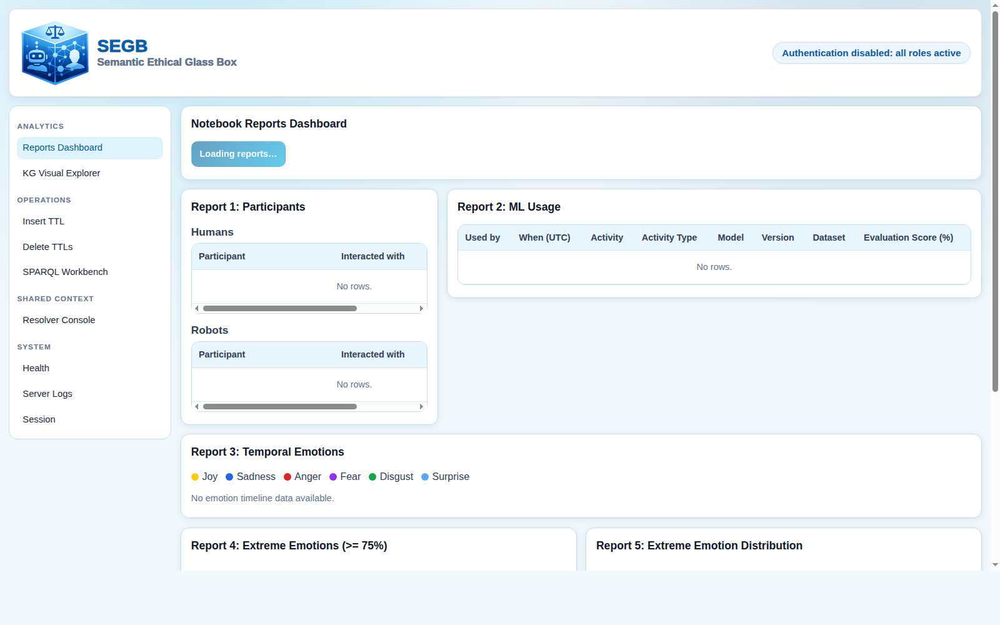

# Web Observability

## Objective

Use the SEGB web UI to validate ingestion, inspect graph data, and monitor backend behavior.

## Prerequisites

- Centralized stack running (see [Centralized Deployment](../deployment/centralized.md))
- Demo dataset loaded
- Optional JWT token if backend auth is enabled (`SECRET_KEY` set)
- Run commands from repository root (`semantic_ethical_glass_box/`)

## Steps

### 1) Open UI

- Production compose: `http://localhost:8080`
- Development compose: `http://localhost:5173`

### 2) Configure session

Open `/session`.

- If auth is disabled, token is ignored.
- If auth is enabled, paste a JWT with required roles.

JWT generation (admin example):

```bash
python3 -m pip install pyjwt fastapi
(
  cd apps/backend/src
  SECRET_KEY="<32+ char secret>" python3 -m tools.generate_jwt \
    --username demo_admin \
    --role admin \
    --expires-in 3600 \
    --json
)
```

Use the same `SECRET_KEY` value configured in `.env`.  
Equivalent flow is documented in [Centralized Deployment: Step 5](../deployment/centralized.md#5-generate-jwt-only-if-auth-enabled).

Session page reference screenshot:


### 3) Use core pages

| Route | Purpose | Roles when auth enabled |
|---|---|---|
| `/reports` | Analytics dashboards | `auditor` or `admin` |
| `/kg-graph` | Graph exploration | `auditor` or `admin` |
| `/query` | Read-only SPARQL workbench | `auditor` or `admin` |
| `/logs/insert` | Validate/insert TTL manually | `admin` |
| `/shared-context` | Review and reconcile shared context | `admin` |
| `/system/logs` | Backend server logs | `admin` |
| `/health` | Liveness/readiness checks | public |

### 4) Recommended operator flow

1. Open `/reports` and refresh.
2. Open `/kg-graph` and check entity/edge growth.
3. Run one read-only query in `/query`.
4. If needed, inspect `/shared-context` and `/system/logs`.

Recommended operator-flow reference screenshot:



## Validation

- Frontend shell loads correctly (top bar, sidebar, route navigation works).
- Reports page renders charts/cards without frontend errors.
- KG Graph renders nodes and edges (canvas/graph view active).
- Health page confirms backend connectivity with `ready=true`.

## Troubleshooting

- Empty reports:
  run UC-02 dataset load again, then refresh `/reports`:

  ```bash
  ./.segb_env/bin/python -m examples.simulations.run_use_case_02_report_ready_dataset \
    --publish-url http://localhost:5000 \
    --no-print-ttl
  ```

  If auth is enabled, add `--token "<admin_jwt>"`.
- `403` on a page: token missing required role.
- Session looks valid but requests fail: token expired; create a new one.
- Health shows `ready=false`: backend cannot reach Virtuoso.
- Health shows `live=false`: backend process is not healthy (startup crash, runtime crash, or restart loop). Check backend logs:

  ```bash
  docker compose -f docker-compose.yaml logs -f amor-segb
  ```
