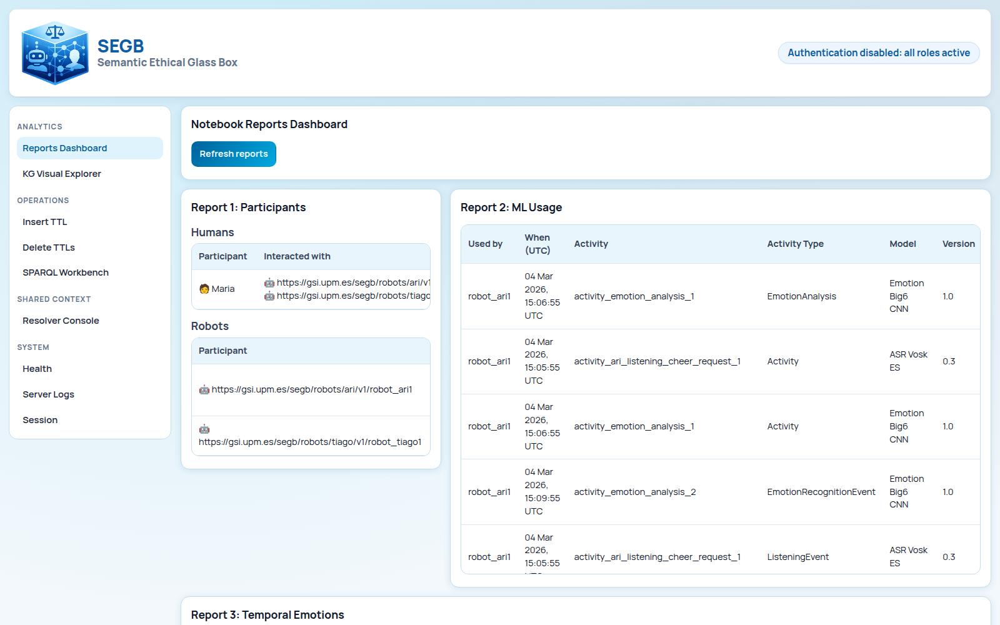

# Real Use Case with Robot Simulator (ROS4HRI)

## Objective

Start from the Part 3 mission controller, apply a demo-only Ollama adaptation, integrate `semantic_log_generator`, and verify results in SEGB UI.

## Prerequisites

- ROS4HRI tutorial completed through Part 3 (`interactive social robots`):
  <https://ros4hri.github.io/ros4hri-tutorials/interactive-social-robots/#part-3-building-a-simple-social-behaviour>
- ROS4HRI Step 3 reference (`emotion mimicking game`):
  <https://ros4hri.github.io/ros4hri-tutorials/interactive-social-robots/#step-3-emotion-mimicking-game>
- Running ROS 2 workspace with `emotion_mirror`
- Access to this SEGB repository (for package + reference implementation)
- Optional SEGB backend running locally (recommended)
- If backend auth is enabled (`SECRET_KEY` set), a valid JWT token (`logger` or `admin`)

## Starting Point Code (Mission Controller Base)

Use this exact `mission_controller.py` as the baseline before Ollama + SEGB integration.

Path in your ROS workspace:

- `ws/src/emotion_mirror/emotion_mirror/mission_controller.py`

```python
import json

from hri import HRIListener
from hri_actions_msgs.msg import Intent
from hri_msgs.msg import Expression
from rclpy.action import ActionClient
from rclpy.node import Node
from rclpy.qos import QoSProfile
from tts_msgs.action import TTS


class MissionController(Node):
    def __init__(self) -> None:
        super().__init__("emotion_mirror")

        self.create_subscription(Intent, "/intents", self.on_intent, 10)
        self.expression_pub = self.create_publisher(Expression, "/robot_face/expression", QoSProfile(depth=10))
        self.hri_listener = HRIListener("mimic_emotion_hrilistener")

        self.tts = ActionClient(self, TTS, "/say")
        self.tts.wait_for_server()

        self._last_expression = ""
        self.create_timer(0.1, self.run)

    def on_intent(self, msg: Intent) -> None:
        try:
            if msg.intent != Intent.RAW_USER_INPUT:
                return

            data = json.loads(msg.data) if msg.data else {}
            text = str(
                data.get("text")
                or data.get("utterance")
                or data.get("message")
                or data.get("object")
                or msg.data
                or ""
            ).strip()
            if not text:
                return

            self._say("I heard you. Could you tell me a bit more so I can help you better?")
        except Exception as error:
            self.get_logger().error(f"on_intent exception (ignored): {type(error).__name__}: {error}")

    def run(self) -> None:
        try:
            faces = list(self.hri_listener.faces.items())
            if not faces:
                return

            _, face = faces[0]
            if not face.expression:
                return

            expression = face.expression.name.lower()
            if expression == self._last_expression:
                return
            self._last_expression = expression

            spoken = f"you look {expression}. Same for me!"
            self._say(spoken)

            out = Expression()
            out.expression = expression
            self.expression_pub.publish(out)
        except Exception as error:
            self.get_logger().error(f"run() exception (ignored): {type(error).__name__}: {error}")

    def _say(self, text: str) -> None:
        goal = TTS.Goal()
        goal.input = text
        self.tts.send_goal_async(goal)
```

Reference final integrated module (Ollama + SEGB), for comparison:

- Repository path: `ros4hri-exchange/ws/src/emotion_mirror/emotion_mirror/mission_controller.py`
- GitHub reference:
  <https://github.com/gsi-upm/semantic_ethical_glass_box/blob/main/ros4hri-exchange/ws/src/emotion_mirror/emotion_mirror/mission_controller.py>

## Steps

### 1) Demo-only Ollama adaptation (before SEGB)

This step is intentionally simple for demo purposes.  
It is not best practice to call Ollama directly from callback flow in production.

Better production pattern:

- run LLM calls in a dedicated async worker/service,
- add retries/timeouts/circuit-breakers,
- keep callback path lightweight.

#### 1.1 Add Ollama import block

```python
...
from tts_msgs.action import TTS

try:
    from ollama import Client as OllamaClient
except Exception:
    OllamaClient = None
...
```

#### 1.2 Add class constants

```python
class MissionController(Node):
    OLLAMA_HOST = "http://127.0.0.1:11434"
    OLLAMA_MODEL = "phi4:14b"
    ...
```

#### 1.3 Initialize client in `__init__`

```python
def __init__(self) -> None:
    ...
    self.ollama = OllamaClient(host=self.OLLAMA_HOST) if OllamaClient else None
    ...
```

#### 1.4 Add `_reply` helper

```python
def _reply(self, text: str, user_name: str) -> tuple[str, str]:
    fallback = "I heard you. Could you tell me a bit more so I can help you better?"
    if not self.ollama:
        return fallback, "fallback"

    system = "You are a friendly social robot. Reply with one short, polite sentence suitable for speech output."
    user = f"User ({user_name}) says: {text}"

    try:
        response = self.ollama.chat(
            model=self.OLLAMA_MODEL,
            messages=[{"role": "system", "content": system}, {"role": "user", "content": user}],
        )
        content = ""
        if hasattr(response, "message") and getattr(response.message, "content", None):
            content = str(response.message.content)
        elif isinstance(response, dict):
            content = str(response.get("message", {}).get("content", ""))
        content = " ".join(content.split()).strip()
        return (content[:280] if content else fallback), ("ollama" if content else "fallback-empty")
    except Exception:
        return fallback, "fallback-ollama-error"
```

#### 1.5 Replace fixed reply in `on_intent`

Replace this:

```python
self._say("I heard you. Could you tell me a bit more so I can help you better?")
```

With:

```python
...
name = str(data.get("name") or data.get("speaker") or data.get("user") or msg.source or "human_user")
reply, _reply_source = self._reply(text, name)
self._say(reply)
...
```

### 2) Start SEGB backend

From SEGB repository root:

```bash
docker compose -f docker-compose.yaml pull
docker compose -f docker-compose.yaml up -d
curl -s http://localhost:5000/healthz/ready
```

Expected: `{"ready": true, "virtuoso": true}`.

If auth is enabled, generate a token:

```bash
PYTHONPATH=apps/backend/src SECRET_KEY="<same_secret_as_env>" python3 -m tools.generate_jwt \
  --username ros_operator \
  --role admin \
  --expires-in 3600 \
  --json
```

### 3) Install `semantic_log_generator` in ROS runtime

Run inside your ROS container/runtime Python environment.

Option A: install from package index

```bash
python -m pip install \
  --index-url https://test.pypi.org/simple/ \
  --extra-index-url https://pypi.org/simple \
  "semantic-log-generator>=1.0.0,<2.0.0"
```

Option B: copy package from SEGB repo and install locally

```bash
cd <your_ros_workspace>
cp -r <path_to_segb_repo>/packages/semantic_log_generator ./src/semantic_log_generator
python -m pip install -e ./src/semantic_log_generator
```

Verify install:

```bash
python -c "from semantic_log_generator import SemanticSEGBLogger; print('ok')"
```

Expected: `ok`.

### 4) Insert SEGB code into `mission_controller.py` (exact places)

#### 4.1 Add imports (top of file)

Insert near existing imports:

```python
...
import threading
from datetime import datetime, timezone
from typing import Any
...
from semantic_log_generator import (
    ActivityKind,
    EmotionCategory,
    EmotionScore,
    RobotStateSnapshot,
    SEGBPublisher,
    SemanticSEGBLogger,
)
from semantic_log_generator.namespaces import EMOML
...
```

Why: adds logging entities, emotion annotation support, and async publication support.

#### 4.2 Add SEGB config constants in class

```python
class MissionController(Node):
    ...
    SEGB_BASE_NAMESPACE = "https://gsi.upm.es/segb/robots/demo_robot/v1/"
    SEGB_ROBOT_ID = "demo_robot"
    SEGB_ROBOT_NAME = "Demo Robot"
    SEGB_LANG = "en"
    SEGB_LOCATION = "location_demo_room"

    SEGB_ENABLE_PUBLISH = True
    SEGB_API_URL = "http://localhost:5000"
    SEGB_API_TOKEN = "<your_jwt_or_empty>"
    SEGB_API_USER = "demo_robot"
    SEGB_TIMEOUT_SECONDS = 15.0
    ...
```

Why: centralizes deployment/auth settings used by logger + publisher.

#### 4.3 Initialize logger + models + publisher in `__init__`

```python
def __init__(self) -> None:
    ...
    self.segb = SemanticSEGBLogger(
        base_namespace=self.SEGB_BASE_NAMESPACE,
        robot_id=self.SEGB_ROBOT_ID,
        robot_name=self.SEGB_ROBOT_NAME,
        default_language=self.SEGB_LANG,
        namespace_prefix="emotion_mirror",
        compact_resource_ids=True,
    )
    self.intent_model = self.segb.register_ml_model("intent_nlu_v1", label="Intent NLU", version="1.0")
    self.emotion_model = self.segb.register_ml_model("emotion_big6_v1", label="Emotion Big6 Classifier", version="1.0")
    self.chat_model = self.segb.register_ml_model(
        "ollama_dialogue_model",
        label=f"Ollama Dialogue ({self.OLLAMA_MODEL})",
        version="1.0",
    )

    self.publisher = None
    if self.SEGB_ENABLE_PUBLISH:
        self.publisher = SEGBPublisher(
            base_url=self.SEGB_API_URL,
            token=self.SEGB_API_TOKEN,
            default_user=self.SEGB_API_USER,
            timeout_seconds=self.SEGB_TIMEOUT_SECONDS,
            verify_tls=True,
            queue_file="/tmp/emotion_mirror/segb_queue.jsonl",
        )
    ...
```

Why: creates semantic graph context and declares which ML models produced each decision.

#### 4.4 Add semantic logging in `on_intent`

Insert inside callback around your dialogue flow:

```python
def on_intent(self, msg: Intent) -> None:
    ...
    now = datetime.now(timezone.utc)
    human_uri = self._human(human_hint, name)

    shared = self.segb.get_shared_event_uri(...)

    listen_act = self.segb.log_activity(...)
    in_msg = self.segb.log_message(...)

    reply, reply_source = self._reply(text, name)
    self._say(reply)

    resp_act = self.segb.log_activity(...)
    self.segb.log_message(...)
    self._state(...)
    self._publish_segb_safe()
    ...
```

Why: links input, decision, response, and robot state in one traceable semantic chain.

Details: [Basic Use](usage.md), [Shared Context Resolution](../backend/shared-context.md).

#### 4.5 Add semantic logging in `run`

Insert in expression handling flow:

```python
def run(self) -> None:
    ...
    shared = self.segb.get_shared_event_uri(...)
    recog = self.segb.log_activity(...)
    obs = self.segb.log_observation(...)
    self.segb.log_emotion_annotation(...)

    self._say(spoken)
    self.expression_pub.publish(out)

    resp = self.segb.log_activity(...)
    self.segb.log_message(...)
    self._state(...)
    self._publish_segb_safe()
    ...
```

Why: captures perception-to-action trace and emotion evidence in the KG.

Details: [Shared Context Resolution](../backend/shared-context.md).

#### 4.6 Add helper methods near class end

```python
def _human(self, hint: str, display_name: str) -> Any:
    ...

def _state(self, *, event_id: str, activity: Any, note: str, extra: dict[str, Any] | None = None) -> None:
    ...

def _publish_segb_safe(self) -> None:
    ...
```

Why:

- `_human`: stable canonical human URIs.
- `_state`: normalized robot-state logging.
- `_publish_segb_safe`: async publish so callbacks stay responsive.

### 5) Build and run ROS package

In your ROS workspace:

```bash
colcon build
source install/setup.bash
ros2 launch emotion_mirror emotion_mirror.launch.py
```

Interact with the simulator (intents + expressions) to generate data.

### 6) Verify in SEGB UI

Open:

- Reports: `http://localhost:8080/reports`
- KG Graph: `http://localhost:8080/kg-graph`

If auth is enabled, set token in `http://localhost:8080/session`.

Expected:

- Reports show non-empty interaction metrics.
- KG Graph shows humans, activities, observations, messages, and states.

Reports reference screenshot:



KG Graph reference screenshot:


Detailed UI guide: [Web Observability](../operations/web-observability.md).

### 7) API-side validation (optional)

Auth disabled:

```bash
curl -s http://localhost:5000/events | head -n 40
```

Auth enabled:

```bash
curl -s http://localhost:5000/events \
  -H "Authorization: Bearer <auditor_or_admin_jwt>" | head -n 40
```

Expected: Turtle output containing recent `emotion_mirror` entities.

## Validation

- ROS node runs without import/runtime failures.
- Interactions appear in `/reports` and `/kg-graph`.
- `GET /events` returns non-empty Turtle.

## Troubleshooting

- `ModuleNotFoundError: semantic_log_generator`: reinstall package in ROS runtime env.
- `401/403` on publish: invalid/missing token or wrong role.
- No UI data: confirm `SEGB_ENABLE_PUBLISH=True` and backend `ready=true`.
- Callback latency: keep publishing async (`_publish_segb_safe`) and avoid heavy sync logic.
